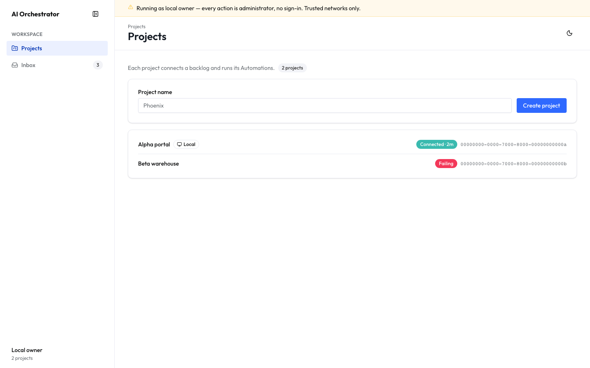
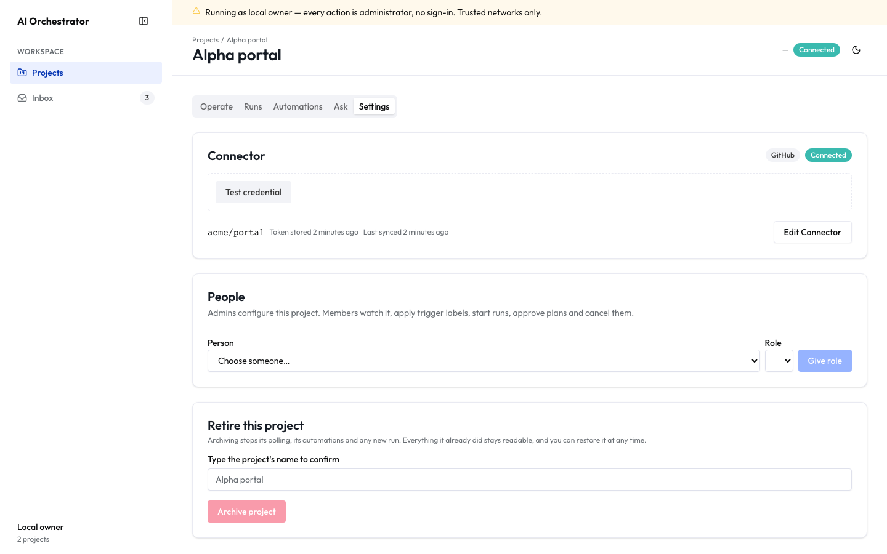
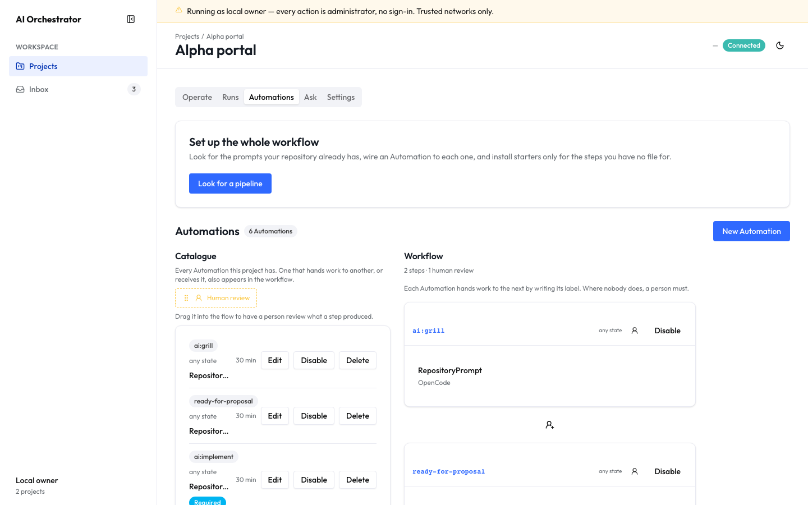
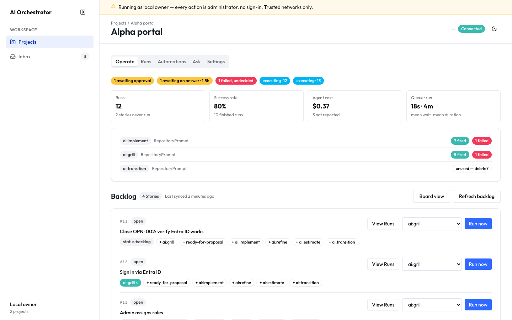
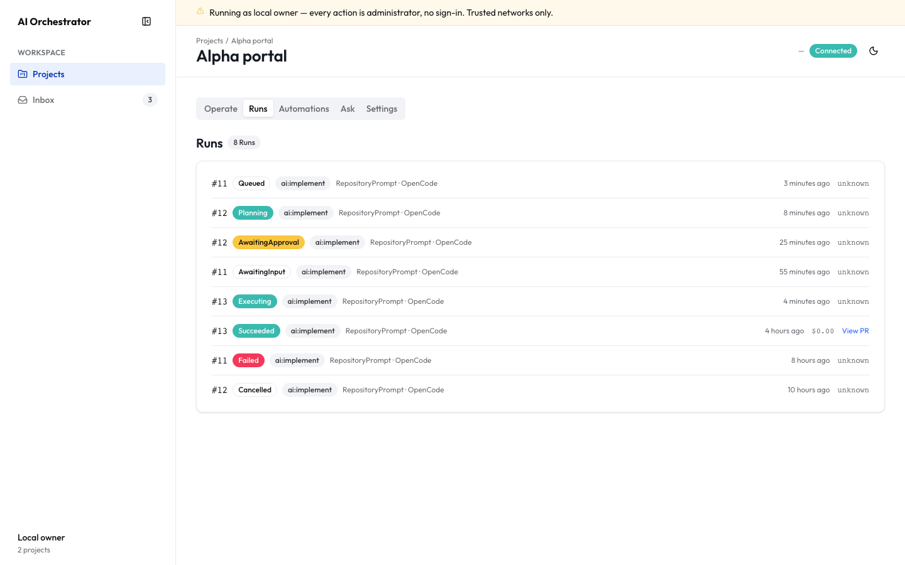
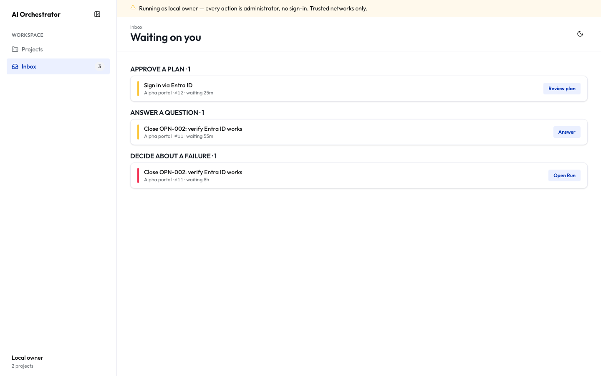
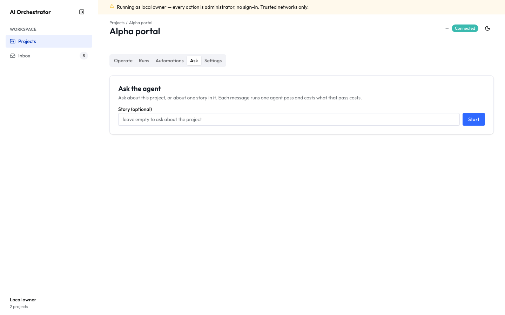

# Using AI Orchestrator

The screens, in the order a project meets them. Each section says what the surface is _for_ —
what it shows is visible in the picture.

This complements [`docs/product/mvp/`](../mvp/00-product-brief.md), which defines what the product
must do in stable IDs. This one is the tour.

> Screenshots come from the mock preview, not a real tenant, so no project, repository or credential
> here belongs to anybody. Refresh them with `scripts/capture-manual-screenshots.sh` after changing a
> surface — a manual that drifts from the product is worse than none.

---

## 1. Projects

Everything is scoped to a **Project**: a backlog, its Automations, its Runs, its credentials. A
project is a name and nothing else at first — the connection comes next.

The banner is the deployment telling you what it is. Where no sign-in is configured, it says so
plainly rather than pretending: _running as local owner, every action is administrator_. That is
correct on a machine one person owns and deliberately loud anywhere else.

---

## 2. Settings — connect a backlog

A **Connector** points the project at a repository and names the credential to reach it with. The
credential is named, never pasted: what the product stores is the _name_ of a secret, and the value
lives in the vault the deployment provides (BR-010).

Nothing else works until this does — the backlog is the source of truth for stories, and every Run
clones the repository it names.

---

## 3. Automations — decide what happens, and when

An **Automation** is a rule: _when a story is labelled `ai:grill`, run this prompt on this runtime_.
What it does is decided by a prompt file in your own repository, read live at Run time — not by
anything chosen in this product.

Three things share this tab.

**Set up the whole workflow** looks for the prompts your repository already has, shows a plan of what
it would wire before you press anything, and installs starters only for steps you have no file for.
Starters arrive as a draft pull request; nothing lands on your default branch.

**The catalogue** is every Automation the project has. **The workflow** is the subset that hands work
to one another — one Automation writes a label, the next one's trigger matches it, and a chain
appears. Where nobody hands on, a person must, and you can drag a human review into the flow.

**New Automation** asks three questions in the order the Automation itself runs: when it fires, what
it does, and what happens after. A sentence at the top restates your answers in prose, so a mistake
is visible before you save rather than after the first Run.

---

## 4. Operate — the backlog and its pulse

The project's stories, mirrored from the vendor and read-only here (BR-008). Applying a trigger label
starts a Run; **Run now** starts one without touching the story's labels.

Above them: what is waiting on a human, what the Runs have cost, how long they queue, and which
Automations have actually fired. An Automation that has never fired says so — a rule nobody triggers
is a rule worth deleting.

A story can hold **one active Run at a time** (BR-001), and a project has a cap on how many run at
once (BR-002).

---

## 5. Runs — what an agent did

Every Run, with its state, its cost and its output. A Run that requires approval stops after
planning and waits: the plan is readable, and nothing executes until somebody approves it.

Cost is honest about what it does not know — a pass whose usage the runtime never reported reads
**unknown**, never zero (BR-011).

Runs are never retried automatically (BR-004). A failure is terminal and a human re-triggers it,
because an agent that quietly runs again is an agent spending money nobody authorised.

---

## 6. Inbox — everything waiting on a person

One list, across every project, of the things that cannot proceed without somebody: a plan awaiting
approval, a failure nobody has re-triggered.

Entries leave when the human has acted — including the derived case, where a failure's story already
has a newer Run. An inbox that only grows stops being read.

---

## 7. Ask — talk to an agent about the project

A conversation with an agent that has the project's repository cloned, about the project or about one
of its stories. Useful for _why did this fail_ and _what would you do here_.

It is **not a Run**: it occupies no cap slot, locks no story, and blocks nothing. An Automation whose
trigger is applied to a story with an open conversation fires exactly as it would otherwise. Each
message costs one agent pass, and the conversation says what it has cost.

---

## Where to go next

| You want                                | Go to                                           |
| --------------------------------------- | ----------------------------------------------- |
| What the product must do, in stable IDs | [docs/product/mvp/](../mvp/00-product-brief.md) |
| How the code is arranged and why        | [ARCHITECTURE.md](../../../ARCHITECTURE.md)     |
| To run the whole thing yourself         | [SELF-HOSTING.md](../../../SELF-HOSTING.md)     |
